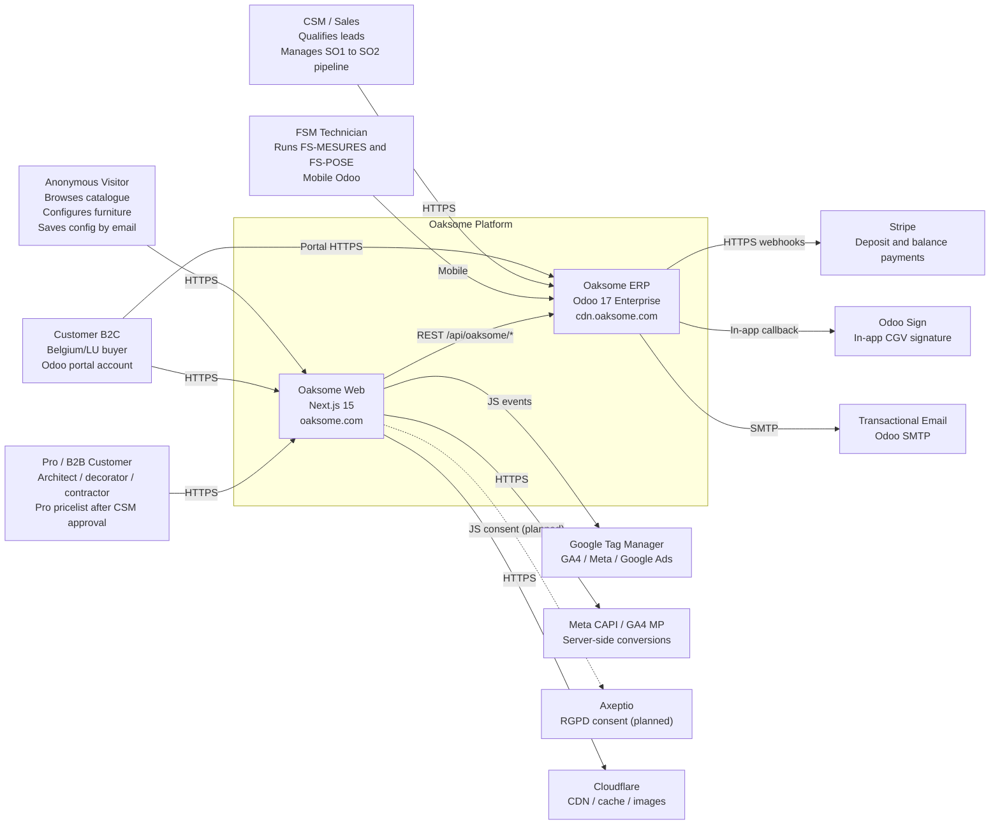

# C1 — System Context

**Scope:** Oaksome (Belgian custom built-in furniture brand) — public website + ordering flow.
**Audience:** New engineers, stakeholders, security reviewers.
**Source:** [System-Design](../System-Design.md), [frontend-spec](../frontend-spec.md), [backend-spec](../backend-spec.md), [api-contract](../api-contract.md).

---

## Diagram

---

## Actors

| Actor | Role | Auth |
|---|---|---|
| **Anonymous Visitor** | Browses, configures, saves config by email | None |
| **Customer (B2C)** | Belgian/LU buyer — orders, tracks, signs CGV | Odoo session |
| **Pro / B2B** | Architect / decorator — pro pricelist after CSM approval | Odoo session (`is_pro=true`) |
| **CSM / Sales** | Internal — lead qualification, SO1→SO2 pipeline | Odoo internal user |
| **FSM Technician** | Field — FS-MESURES checklist + FS-POSE | Odoo mobile |

## External Systems

| System | Purpose | Owned by |
|---|---|---|
| **Stripe** | 50% deposit + balance payments | Odoo (`payment_stripe`) |
| **Odoo Sign** | In-app CGV signature | Odoo native |
| **Google Tag Manager** | Tag dispatch (GA4, Meta, Google Ads) | Next.js |
| **Meta CAPI / GA4 MP** | Server-side conversions (`/api/tracking/capi`) | Next.js |
| **Axeptio** | RGPD consent — **planned**, not yet integrated | Next.js |
| **Cloudflare** | CDN, edge cache | Infra |
| **Transactional Email** | Order/FSM/invoice emails | Odoo SMTP |

## Boundaries

- **Oaksome Platform** owns: Next.js web + Odoo ERP + custom addons + 41 REST endpoints.
- **Not in scope (Phase 1):** ES (Belgium + Luxembourg only), social login, multi-currency beyond EUR.
- **Checkout handoff:** localStorage cart → Odoo session sync → Odoo handles checkout/CGV/payment → redirect back to `oaksome.com/checkout/success`.

## Key Decisions Reflected

- **Custom REST**, not JSON-RPC (`/api/oaksome/*`, 41 endpoints in 5 tiers).
- **Two domains** by design: `oaksome.com` (Next.js) ↔ `cdn.oaksome.com` (Odoo) — CORS with credentials.
- **localStorage-first** cart/wishlist, synced to Odoo only at checkout.
- **Server-side tracking** (CAPI + GA4 MP) routed through Next.js API to bypass adblockers / ITP.

## Open Questions

- [ ] Axeptio integration — timeline and owner (currently no CMP wired; consent UX is a gap for RGPD).
