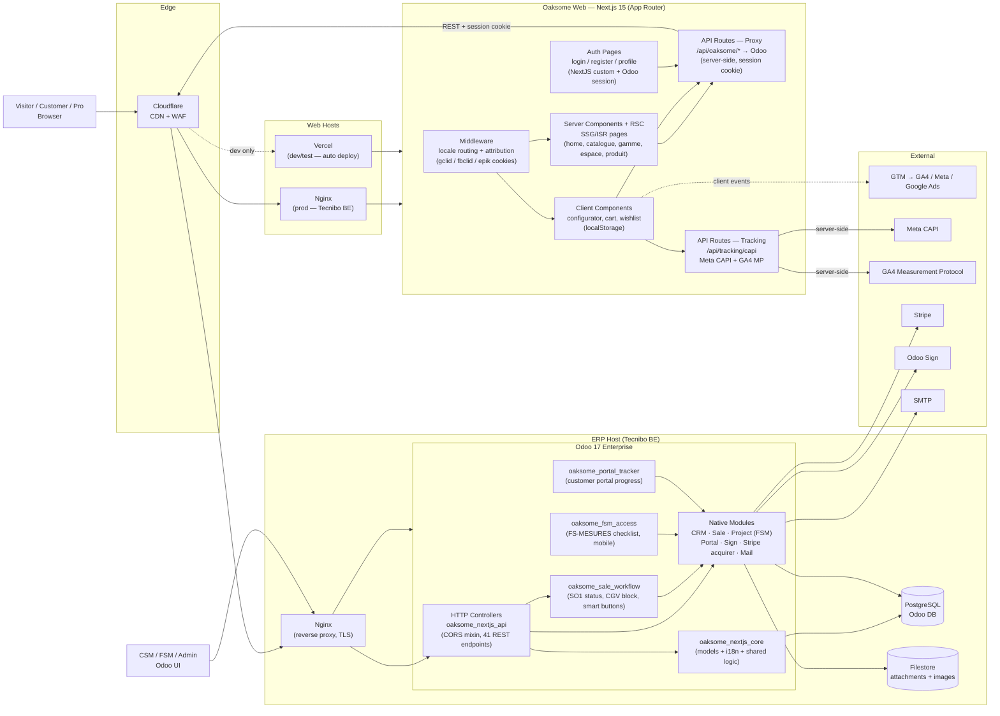

# C2 — Container

**Scope:** Zooms into the two systems from [C1](c1-context.md) — Oaksome Web (Next.js) and Oaksome ERP (Odoo) — and shows the deployable/runnable units inside them plus the runtime data stores.
**Audience:** Engineers onboarding to the codebase, DevOps, security reviewers.
**Source:** [System-Design](../System-Design.md), [frontend-spec](../frontend-spec.md), [backend-spec](../backend-spec.md), [api-contract](../api-contract.md).

---

## Diagram

---

## Containers — Oaksome Web (Next.js 15)

| Container | Tech | Responsibility |
|---|---|---|
| **Middleware** | `middleware.ts` | Locale routing (`/fr`, `/nl`), attribution capture (`gclid`/`fbclid`/`epik` → first-party cookies, 90d) |
| **Server Components / RSC** | Next.js App Router | SSG/ISR for home, catalogue, gamme, espace, product detail. Caching per [System-Design §6](../System-Design.md) |
| **Client Components** | React 18 | Configurator (multi-step state), cart, wishlist, share popups. State in `localStorage`. |
| **API Proxy** | Next.js Route Handlers | Server-side proxy `/api/oaksome/*` → Odoo with session cookie forwarding (bypasses CORS for SSR) |
| **Tracking API** | Next.js Route Handlers | `/api/tracking/capi` — server-to-server to Meta CAPI + GA4 MP (Safari ITP + adblock proof) |
| **Auth Pages** | Next.js + custom forms | `/login`, `/register`, `/profile` — credentials posted to `/api/oaksome/auth/*`, Odoo issues session |

## Containers — Oaksome ERP (Odoo 17 Enterprise)

| Container | Tech | Responsibility |
|---|---|---|
| **HTTP Controllers** | `oaksome_nextjs_api` (Python) | 41 REST endpoints under `/api/oaksome/*` with shared CORS mixin + uniform response envelope (`{success,data,meta}`) |
| **Core models** | `oaksome_nextjs_core` | Shared Oaksome models (`oaksome.style`, `space`, `inspiration`, `case`, etc.), i18n helpers |
| **Sale workflow** | `oaksome_sale_workflow` | Blocks `action_confirm()` if CGV unsigned, computed `oaksome_status` (7-step), SO1 view + smart buttons |
| **FSM access** | `oaksome_fsm_access` | FS-MESURES delivery-access checklist on `project.task`, mobile-optimized view |
| **Portal tracker** | `oaksome_portal_tracker` | Customer-facing 7-step progress bar in Odoo Portal |
| **Native modules** | Odoo Enterprise | CRM, Sale, Project (FSM), Portal, Sign, Stripe acquirer, Mail (transactional) |
| **PostgreSQL** | DB | Single Odoo DB — products, orders, CRM, sessions, partners |
| **Filestore** | Local volume (Tecnibo host) | Image attachments (`product.gallery.image`, `custom.product.image`, signatures) — no S3 yet |

## Edge & Hosting

| Container | Tech | Notes |
|---|---|---|
| **Cloudflare** | CDN + WAF | TTLs per [System-Design §6](../System-Design.md) — 30min catalogue, 30d images, no-cache cart/leads. Fronts `oaksome.com` and `cdn.oaksome.com` |
| **Nginx (Web)** | Nginx | Reverse proxy + TLS in front of Next.js Docker container (Tecnibo, Belgium) |
| **Nginx (ERP)** | Nginx | Reverse proxy + TLS in front of Odoo (Tecnibo, Belgium) |
| **Vercel** | PaaS | Dev/test only — auto-deploy on push to `main` |

## Key Flows

### Browse + Configure (anonymous)
`Visitor → Cloudflare → Nginx → Next.js RSC → API proxy → Odoo controllers → Postgres` (ISR-cached on Next.js, edge-cached on Cloudflare).

### Save configuration (lead)
`Client component → /api/oaksome/leads (proxy) → Odoo controllers → crm.lead created → CSM automation J+1`.

### Cart → Checkout handoff
1. Client adds items → `localStorage` only (no server call).
2. Click "Commander" → loop `POST /api/oaksome/cart/add` syncs items to Odoo.
3. If country=BE → optional TVA 6% step → `PUT /api/oaksome/profile`.
4. `GET /api/oaksome/cart/checkout-url` returns Odoo URL with session.
5. Redirect to Odoo → CGV signature (Odoo Sign) → 50% deposit (Stripe) → redirect back to `oaksome.com/checkout/success`.

### Server-side conversion tracking
`Client event → /api/tracking/capi → Meta CAPI + GA4 MP` (reads `gclid`/`fbclid` cookies set by middleware).

## Cross-cutting

- **Auth:** Odoo session cookie is the source of truth. Next.js API proxy forwards the cookie; SSR pages can read it for server components that need user context.
- **CORS:** Custom mixin in `oaksome_nextjs_api/controllers/api.py` — allows `oaksome.com` origin + credentials.
- **i18n:** `next-intl` on web (FR default + NL prefix). Odoo uses native multi-lang; API accepts `?lang=fr|nl`.
- **Country/TVA:** `?country=BE` param on product endpoints; Odoo applies pricelist + TVA 6% flag at SO1 creation.

## Notes & Backlog

- **Odoo domain:** `cdn.oaksome.com` is the public face of Odoo. `oaksome.tecnibo.com` and the legacy `oaksome_website` addon are deprecated — ignore in current architecture.
- **Filestore:** local volume on the Tecnibo host. No S3/object storage yet. Backup policy is host-level.
- **Session store (backlog):** Odoo runs without Redis today — single worker / filesystem sessions. **Planned:** add Redis to enable multi-worker session sharing once traffic warrants it.
- **Update [System-Design](../System-Design.md)** to reflect the `cdn.oaksome.com` rename.
