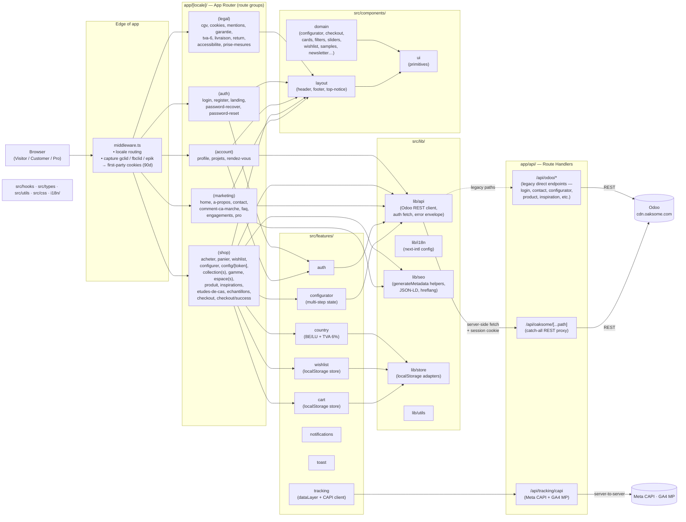
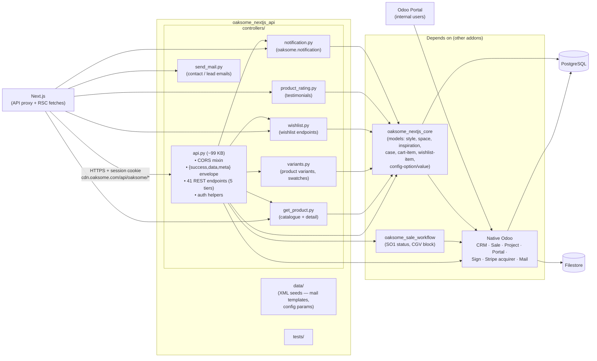

# C3 — Component

**Scope:** Zooms into the two most complex containers from [C2](c2-container.md):
- **C3a:** Oaksome Web (Next.js 15) — route groups, features, lib, middleware.
- **C3b:** `oaksome_nextjs_api` Odoo addon — HTTP controllers, CORS mixin, data, tests.

**Audience:** Engineers making changes inside these containers — onboarding, refactoring, code review.
**Source:** Live filesystem (`oaksome-web/src/`, `odoo/custom/website/oaksome_nextjs_api/`) + [api-contract](../api-contract.md) + [frontend-spec](../frontend-spec.md).

---

## C3a — Oaksome Web (Next.js 15)

### Diagram

### Components

| Component | Path | Responsibility |
|---|---|---|
| **Middleware** | `src/middleware.ts` | Locale prefix enforcement, attribution click-ID capture into first-party cookies |
| **Route groups** | `src/app/[locale]/(...)` | `(marketing)` · `(shop)` · `(account)` · `(auth)` · `(legal)` — share layouts within each group |
| **API proxy** | `src/app/api/oaksome/[...path]/route.ts` | Catch-all server-side proxy to Odoo `/api/oaksome/*` — forwards session cookie, applies CORS envelope |
| **Legacy API routes** | `src/app/api/odoo/*/route.ts` | Direct endpoints (login, contact, product, configurator, etc.) — predates the catch-all proxy. **Backlog:** consolidate under `/api/oaksome/[...path]`. |
| **Tracking API** | `src/app/api/tracking/capi/route.ts` | Server-to-server Meta CAPI + GA4 MP — reads attribution cookies set by middleware |
| **Features** | `src/features/{auth,cart,wishlist,configurator,country,notifications,toast,tracking}` | Self-contained vertical slices — own state, hooks, components |
| **lib/api** | `src/lib/api/` | Typed Odoo client (used by RSC + features) — wraps fetch, handles `{success,data,meta}` envelope |
| **lib/i18n** | `src/lib/i18n/` | `next-intl` configuration, message loading |
| **lib/seo** | `src/lib/seo/` | `generateMetadata` helpers, JSON-LD builders, hreflang alternates |
| **lib/store** | `src/lib/store/` | `localStorage` adapters consumed by cart/wishlist/country features |
| **components/layout** | `src/components/layout/` | Header (incl. `header-client.tsx`), footer, top notice |
| **components/ui** | `src/components/ui/` | Primitives shared across the app |
| **components/domain** | `src/components/{configurator,checkout,cards,filters,sliders,wishlist,samples,newsletter,...}` | Composed UI per feature area |

### Notes

- `app/[locale]/(shop)/` is the heaviest route group — owns catalogue, configurator, cart, wishlist, checkout.
- `src/features/` follows a feature-first split; cross-cutting code lives in `src/lib/`.
- Tests are co-located (`__tests__/` folders next to the code) — see `configurer/__tests__`, `login/__tests__`, `lib/api/__tests__`, etc.

---

## C3b — `oaksome_nextjs_api` (Odoo addon)

### Diagram

### Components

| File | Approx size | Responsibility |
|---|---|---|
| `controllers/api.py` | ~99 KB | **Main controller.** CORS mixin, shared auth helpers, response envelope, the bulk of the 41 REST endpoints (navigation, home, collections, gammes, espaces, cart, leads, auth, profile, orders, notifications, search, contact) |
| `controllers/get_product.py` | ~16 KB | Product list + detail endpoints — pricing, gallery, config options |
| `controllers/variants.py` | ~7 KB | Variant resolution + swatches |
| `controllers/wishlist.py` | <1 KB | Thin wishlist endpoints (delegated to core models) |
| `controllers/notification.py` | ~1 KB | `oaksome.notification` GET + mark-read |
| `controllers/product_rating.py` | ~3 KB | Testimonials endpoint |
| `controllers/send_mail.py` | ~3 KB | Contact / sample-request / lead email dispatch |
| `data/` | — | Mail templates, config parameters (CORS allowed origins, etc.) |
| `tests/` | — | Endpoint integration tests |

### Cross-addon dependencies

| Calls into | Why |
|---|---|
| `oaksome_nextjs_core` | All custom models — products extensions, styles, spaces, content, cart/wishlist items, config options |
| `oaksome_sale_workflow` | SO1 status computation, CGV block — read by `/orders` endpoints |
| Native Odoo (CRM/Sale/Project/Portal/Sign/Mail/Stripe) | Lead creation, order creation, FSM tasks, portal access, signatures, payments |

### Notes

- `api.py` is doing a lot — controller, mixin, envelope, auth, and most endpoints in one file. **Refactor backlog:** split into one module per tier (`tier1_catalogue.py`, `tier2_leads.py`, …) and lift the CORS mixin into `controllers/_mixin.py`.
- `tracking/capi` infra endpoints live on the **Next.js** side, not in this addon — see [C3a](#c3a--oaksome-web-nextjs-15).
- `oaksome_website` (legacy) is **not** part of the current architecture — ignored even though it still sits in `odoo/custom/website/`.

---

## Open Questions / Backlog

- [ ] Consolidate Next.js `app/api/odoo/*` legacy routes under the `/api/oaksome/[...path]` catch-all proxy.
- [ ] Split `controllers/api.py` (~99 KB) into per-tier modules; extract CORS mixin.
- [ ] Map `oaksome_backend` addon — is it admin views only, or does it host any endpoints? (Mentioned in `odoo/custom/website/` but not in [backend-spec](../backend-spec.md).)
- [ ] Document `oaksome_nextjs_core` models in C4 (or rely on [data-model](../data-model.md)).
