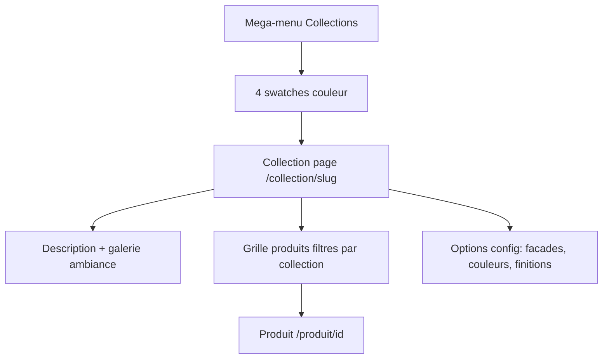
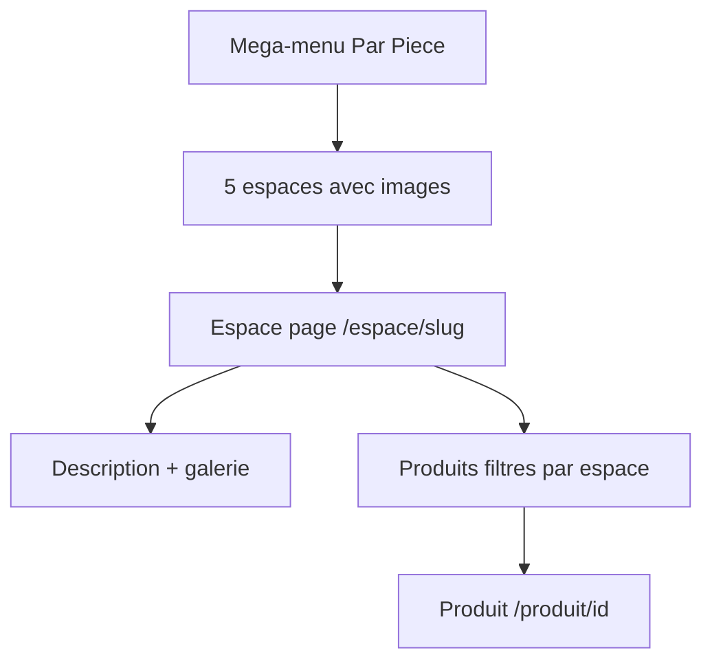
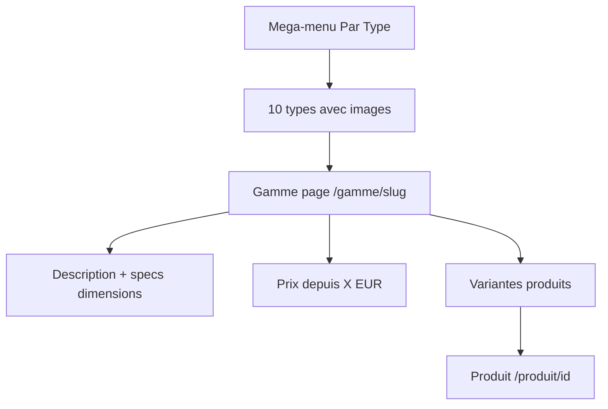
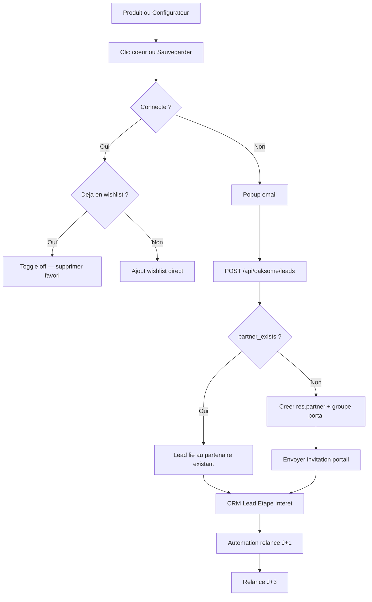
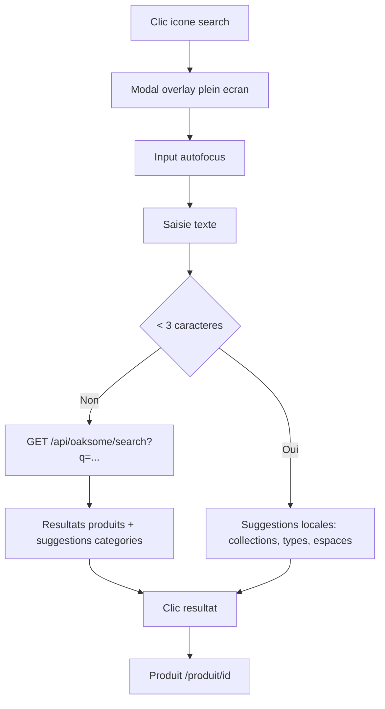
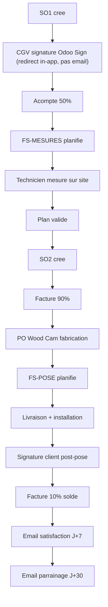
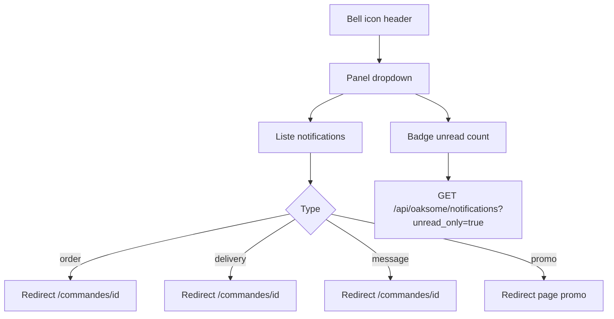

# Oaksome — User Flows

> 14 parcours utilisateur documentes depuis le prototype HTML/JS
> Derniere maj : 2026-04-08

---

## Flow 1 — Browse & Buy

Parcours principal : decouverte → achat.

```mermaid
graph TD
    A[Homepage] --> B{Navigation}
    B --> C[Catalogue /acheter]
    B --> D[Gamme /gamme/slug]
    B --> E[Espace /espace/slug]
    B --> F[Collection /collection/slug]
    C --> G[Filtres: type/espace/collection/prix/finition]
    G --> H[Produit /produit/id]
    D --> H
    E --> H
    F --> H
    H --> I[Add to Cart]
    I --> J[Cart overlay]
    J --> K{Connecte ?}
    K -->|Oui| L[Checkout]
    K -->|Non| M[Redirect /login]
    M --> L
    L --> N[Redirect Odoo checkout]
    N --> O[Paiement]
    O --> P[/checkout/success]
```

**Details :**
- Cart stocke en localStorage (CSR)
- Clic "Commander" → sync cart vers Odoo via `POST /api/oaksome/cart/add`
- Si `country=BE` : etape intermediaire TVA 6% — annee de construction du logement. Si > 10 ans → position fiscale renovation appliquee sur le SO1
- `GET /api/oaksome/cart/checkout-url` → redirect vers Odoo
- Apres paiement → redirect `oaksome.com/checkout/success?order=xxx`
- Bouton "Partager" sur la fiche produit → popup email → `POST /api/oaksome/leads` avec `share=true` → lien copiable (tracabilite CRM)

---

## Flow 2 — Collection Discovery

Navigation par collection (Line, Satori, Vista, Lys).



---

## Flow 3 — Space/Room Discovery

Navigation par piece (5 espaces).



---

## Flow 4 — Type/Gamme Discovery

Navigation par type de meuble (10 gammes).



**Gammes :** Dressings, Bibliotheques, Meubles TV, Ensembles muraux, Commodes, Buffets, Bureaux, Entree, Placards, Pont

---

## Flow 5 — Configurateur

Tunnel multi-etapes pour configurer un meuble sur mesure.

```mermaid
graph TD
    A[CTA Configurateur] --> B[/configurer]
    B --> C[Choix Type meuble]
    C --> D[Choix Collection]
    D --> E[Choix Facade]
    E --> F[Choix Couleur]
    F --> G[Dimensions W x D x H]
    G --> H[Prix temps reel]
    H --> I{Action}
    I -->|Sauvegarder| J[Popup email]
    I -->|Partager| J2[Popup email]
    I -->|Add to Cart| K[Cart]
    J --> L["POST /api/oaksome/leads"]
    J2 --> L2["POST /api/oaksome/leads (share=true)"]
    L --> M[CRM Lead Etape 1]
    L2 --> N[Lead + share_url copiable]
```

**Interface :**
- Grid 7fr (viewer) + 5fr (panel options)
- Panel scrollable avec prix sticky en bas
- Bouton fermer (X) pour quitter le tunnel
- Boutons finaux : "Sauvegarder" | "Partager" | "Ajouter au panier"

---

## Flow 6 — Wishlist / Lead

Sauvegarde favori → capture email → lead CRM.



---

## Flow 7 — Inspiration & Etudes de cas

Decouverte par l'inspiration visuelle.

```mermaid
graph TD
    A[/inspirations] --> B[Filtre par source: oaksome/instagram/pinterest]
    B --> C[Grille cards avec hover]
    C --> D{Type}
    D -->|Inspiration| E[Vue agrandie]
    D -->|Etude de cas| F[/etude-de-cas/slug]
    F --> G[Galerie avant/apres]
    F --> H[Produits associes]
    H --> I[Produit /produit/id]
```

---

## Flow 8 — Search

Recherche hybride : suggestions instantanees + resultats API.



**Hints affiches :** "Essayez : dressing, bibliotheque, Satori, chambre..."

---

## Flow 9 — Echantillons

Deux concepts disponibles sur `/echantillons` :

### 9a — Pack echantillons (gratuit)

Client decouvre les materiaux sans engagement.

```mermaid
graph TD
    A[/echantillons] --> B[Choix collection]
    B --> C[Choix materiau]
    C --> D["Choix 1-2 paires couleurs (ext + int)"]
    D --> E[Formulaire: nom, email, adresse]
    E --> F["POST /api/oaksome/samples/request"]
    F --> G[crm.lead Etape Echantillons]
    F --> H[SO gratuit lignes a 0 EUR]
    H --> I[Expedition < 48h]
    I --> J[Relance J+5 post-reception]
```

**Details :**
- Gratuit, pas de paiement
- Cree un `crm.lead` (pipeline CRM, etape Echantillons) + un `sale.order` avec lignes produit echantillon a 0€
- Aucun compte requis (formulaire anonyme nom/email/adresse)

### 9b — Kit decouverte (100€)

Kit premium avec un panneau de facade complet.

```mermaid
graph TD
    A[/echantillons] --> B[Choix collection]
    B --> C[Choix facade]
    C --> D["Choix couleur ext + couleur int"]
    D --> E[Choix poignee]
    E --> F[Ajouter au panier]
    F --> G[Cart overlay]
    G --> H[Checkout normal Odoo]
    H --> I[Paiement 100 EUR]
    I --> J[/checkout/success]
```

**Details :**
- Produit `product.template` standard Odoo a 100€
- Tunnel de selection : collection → facade → couleur ext/int → poignee
- Checkout identique au flow Browse & Buy (Flow 1)

---

## Flow 10 — Pro/B2B

Inscription professionnel pour tarifs dedies.

```mermaid
graph TD
    A[/pro] --> B[Page presentation avantages pro]
    B --> C[CTA Inscription]
    C --> D[/pro/inscription]
    D --> E["Formulaire: entreprise, BCE/KBO, email, tel"]
    E --> F["POST /api/oaksome/auth/register (is_pro=true)"]
    F --> G[Redirect /profile — bandeau en attente validation]
    G --> H{Validation CSM dans Odoo}
    H -->|Approuve| I[Email approbation + pricelist Pro activee]
    I --> J[Prix pro affiches sur le site quand connecte]
    H -->|Refuse| K[Email refus]
```

**Details :**
- Pas de SLA formel pour la validation (best effort CSM)
- Apres inscription, redirect vers `/profile` avec bandeau "Compte pro en attente de validation"
- Le pro peut naviguer le site normalement mais voit les prix publics tant que non approuve
- Approbation dans Odoo : CSM active `is_pro=True` + assigne la pricelist "Pro" (remise % globale)
- Une fois approuve : tous les prix affiches sur le site sont les prix pro (pricelist appliquee via la session utilisateur)
- Un seul email : approbation ou refus

---

## Flow 11 — Auth & Profile

Gestion compte utilisateur (NextJS custom).

```mermaid
graph TD
    A[/login] --> B[Email + password]
    B --> C["POST /api/oaksome/auth/login"]
    C --> D[Session cookie Odoo]
    D --> E[/profile]
    E --> F[Infos personnelles]
    E --> G[/commandes]
    G --> H[Liste SO1 + SO2]
    H --> I[/commandes/id]
    I --> J[Tracker oaksome_status 9 etats]
    I --> K[Historique factures]
    I --> L[Documents signes]
```

**Inscription :**
```
/register → POST /api/oaksome/auth/register → confirmation email → /login
```

**Mot de passe oublie :**
```
/password-recover → email reset → nouveau mot de passe → /login
```

---

## Flow 12 — Post-achat (source: sale_process.md)

Suivi complet apres commande.



**9 etats `oaksome_status` (computed sur sale.order) :**

| # | Cle | Label portail |
|---|---|---|
| 1 | `cgv_pending` | A signer CGV |
| 2 | `deposit_pending` | Acompte en attente |
| 3 | `measures_pending` | A mesurer |
| 4 | `measures_scheduled` | Mesures planifiees |
| 5 | `plan_validated` | Plan valide |
| 6 | `manufacturing` | En fabrication |
| 7 | `ready` | Pret a livrer |
| 8 | `delivering` | Livraison & pose |
| 9 | `done` | Termine |

> Les etapes pre-SO1 (lead, contact, echantillons) vivent dans le pipeline CRM natif.
> Le portail client montre 7 etapes simplifiees (voir [data-model](data-model.md)).

---

## Flow 13 — Contact

Formulaire de contact route par type.

```mermaid
graph TD
    A[/contact] --> B[Selection type]
    B --> C{Type}
    C -->|Commercial| D["POST /api/oaksome/contact (type=commercial)"]
    C -->|Support/SAV| E["POST /api/oaksome/contact (type=support)"]
    C -->|Pro/B2B| F["POST /api/oaksome/contact (type=pro)"]
    D --> G[crm.lead equipe commerciale]
    E --> H[helpdesk.ticket equipe support]
    F --> I[crm.lead equipe B2B]
    G --> J[Reponse < 24h]
    H --> J
    I --> J
```

---

## Flow 14 — Notifications

Systeme de notifications in-app.



**Sources de notifications :**
- Changement statut commande
- Mesures/livraison planifiees
- Documents a signer
- Promotions
- Messages CSM

---

## Flow 15 — Partage de configuration (parcours destinataire)

Le destinataire (conjoint, architecte, decorateur) recoit un lien partage sans avoir de compte.

```mermaid
graph TD
    A[Destinataire recoit lien] --> B[/config/token]
    B --> C{Token valide ?}
    C -->|Non/Expire| D["Message: Configuration non disponible"]
    D --> E[CTA vers /configurer]
    C -->|Oui| F[Affichage produit + config + prix]
    F --> G{Action}
    G -->|Modifier| H["/configurer?from_share=token"]
    G -->|Commander| I["/produit/id (config pre-selectionnee)"]
    H --> J[Configurateur pre-rempli localement]
    J --> K[Flow 5 normal]
    I --> L[Flow 1 normal]
```

**Details :**
- Aucun compte requis pour consulter le lien
- "Modifier" → pre-remplissage local du configurateur (pas de mise a jour du lead original)
- Si le destinataire sauvegarde sa modification → nouveau lead via `POST /api/oaksome/leads`
- Expiration : 90 jours
- Si expire : affiche un message avec CTA vers le configurateur

---

## References

- API contract : [api-contract](api-contract.md)
- Frontend spec : [frontend-spec](frontend-spec.md)
- Backend spec : [backend-spec](backend-spec.md)
- Sale process : [Oaksome_sale_process](Oaksome_sale_process.md)
- Data model : [data-model](data-model.md)
